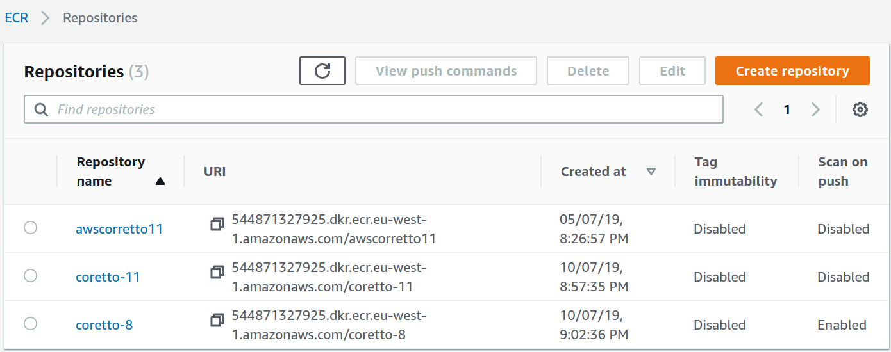
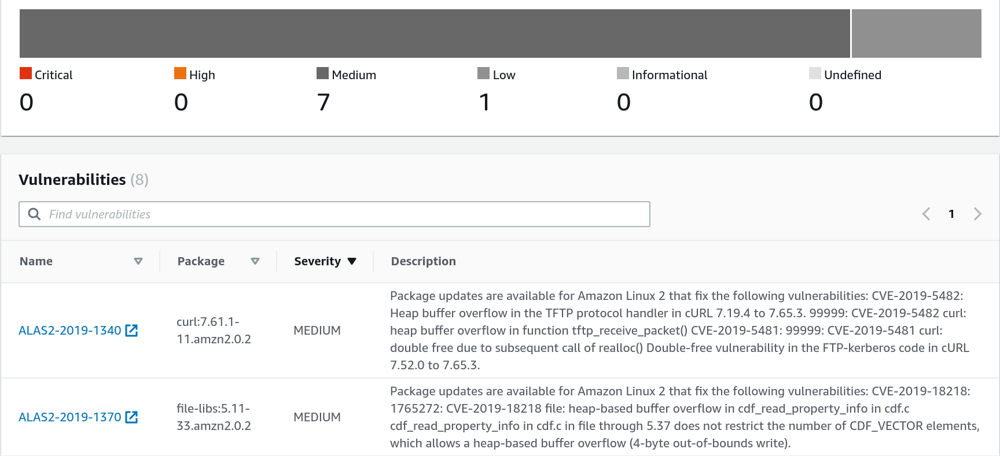
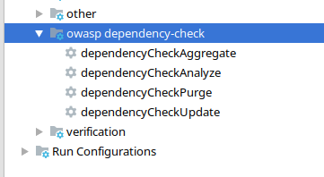
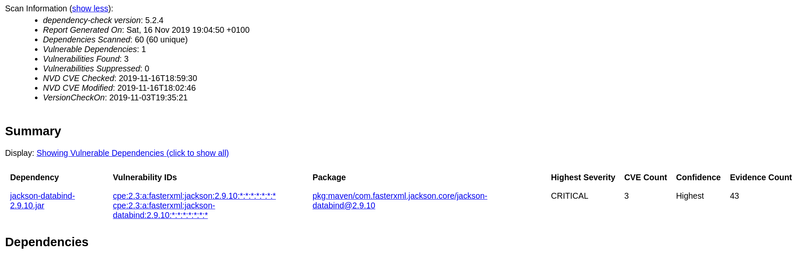
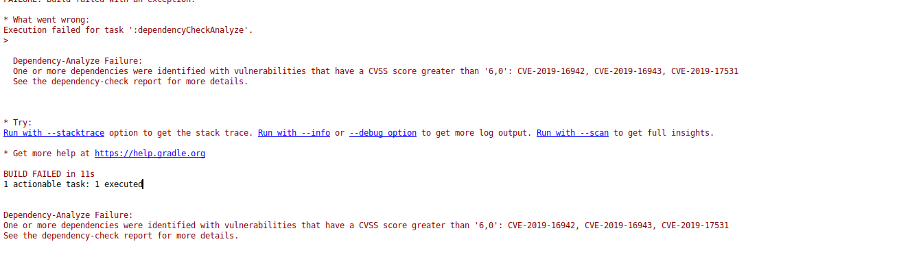

<!-- markdownlint-disable MD012 MD014 MD033-->

# Security in CI / CD Pipelines

Vulnerability Scanning


## Workstreams on team level 2019

* Continuous Integration/ Deployment
* Infrastructure
* Monitoring
* Operations
* Testing
* UI Consolidation


## Continuous Integration/ Deployment

  * _Verify_ and _Package_ steps in TeamCity
  * Deployment via TeamCity/ Chef  or Chef only
  * Static code analysis using Sonarqube

>  Automation is key


## AWS Paas Project

* Elastic Container Registry with _Scan on Push_
* Clair used for vulnerability scanning



Detailed scan information




## What to check

* Container images
* Operating system
  * Installed software packages
* **Application level**
  * Code
  * Used libraries and frameworks
* ...


## Scanning in Java based projects

* OWASP Dependency-Check
* Supports Java and .NET
* Experimental analyzers for Python, Ruby, PHP, and Node.js

> Open Web Application Security Project is a worldwide not-for-profit charitable organization focused on improving the security of software.


## How it works

* CVE data comes from the National Vulnerability Database (NVD) 
* Hosted by National Institute of Standards and Technology  (NIST)

```xml
  <entry id="CVE-2012-5055">
  ...
    <vuln:vulnerable-software-list>
      <vuln:product>cpe:/a:vmware:springsource_spring_security:3.1.2</vuln:product>
      <vuln:product>cpe:/a:vmware:springsource_spring_security:2.0.4</vuln:product>
      <vuln:product>cpe:/a:vmware:springsource_spring_security:3.0.1</vuln:product>
    </vuln:vulnerable-software-list>
  </entry>
```
 
 * A JarAnalyzer will collect information from the manifest, pom.xml, and the package names within the JAR files scanned


### Invocation

* Command Line
* ~~Ant Task~~
* Maven Plugin
* Gradle Plugin

### Plugins

* Jenkins
* sbt
* SonarQube


### Gradle Plugin

```json
plugins {
    id "fr.brouillard.oss.gradle.jgitver" version "0.10.0-rc01"
    id "io.franzbecker.gradle-lombok" version "3.2.0"
    id "java"
    id "idea"
    id "org.owasp.dependencycheck" version "5.2.4"
}
```





| Task| Description |
| --- | ---|
|dependencyCheckAnalyze | Runs dependency-check against the project and generates a report.
|dependencyCheckAggregate | Runs dependency-check against a multi-project build and generates a report.
|dependencyCheckUpdate | Updates the local cache of the NVD data from NIST.
|dependencyCheckPurge | Deletes the local copy of the NVD. This is used to force a refresh of the data.


Scan information




Configuration options

* Build fails if a CVSS score equal to or above a specified level is identified.

```json
dependencyCheck {
    failBuildOnCVSS=6
}
```




* analyzedTypes<br /> Artifact types that will be analyzed (jar, war, ear, zip)
* skipTestGroups<br />All dependency groups that being with ‘test’ will be skipped


## Outlook
 
 * Take actions based on report outcome
 * Understand what risk level is acceptable:<br />Not all CVEs have a fix
 * Automate update of NVD data


## Further information

* [OWASP](https://www.owasp.org/index.php/Main_Page)
* [OWASP Dependency Check](https://jeremylong.github.io/DependencyCheck/)
* [NVD Homepage](https://nvd.nist.gov)
* [Wikipedia on CVE](https://en.wikipedia.org/wiki/Common_Vulnerabilities_and_Exposures)
* [Wikipedia on CVE Scoring System](https://en.wikipedia.org/wiki/Common_Vulnerability_Scoring_System)
