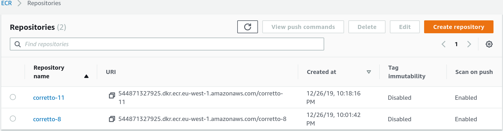

<!-- markdownlint-disable MD012 MD014 -->

# Security in CI / CD Pipelines


## Continuous Improvments on team level 2019

* Continuous Integration/ Deployment
* Monitoring
* Operations
* Infrastructure
* UI Consolidation


## Continuous Integration/ Deployment

Automation

* _Verify_ and _Package_ steps in TeamCity
* Deployment via TeamCity job or Chef
* Sonarqube

TODO: Add Confluence link or screenshot


## AWS Paas Project

* Elastic Container Registry (ECR)
* _Scan on Push_ feature




Scanned images with high level information


Detailed information of a scan


## Scanning for vulnerabilties

* Docker container images
* Operating system
  * Installed software packages
* Application
  * Used libraries and frameworks


## Scanning for Java based projects

> The Open Web Application Security Project (OWASP) is a worldwide not-for-profit charitable organization focused on improving the security of software.

* Flagship project: OWASP Dependency-Check
* Supports Java and .NET
* Experimental analyzers for Python, Ruby, PHP (composer), and Node.js applications
  * rates of possible false positive and false negative


## How it works

* Data used is from the National Vulnerability Database (NVD) hosted by NIST: https://nvd.nist.gov


### Invocation

* Command Line
* Ant Task
* Maven Plugin
* Gradle Plugin


Other Plugins

* Jenkins Plugin
* sbt Plugin
* SonarQube Plugin


### Gradle Plugin

```json
plugins {
    id "fr.brouillard.oss.gradle.jgitver" version "0.10.0-rc01"
    id "io.franzbecker.gradle-lombok" version "3.2.0"
    id "java"
    id "idea"
    id "org.owasp.dependencycheck" version "5.2.4"
}
```


| Task| Description |
| --- | ---|
|dependencyCheckAnalyze | Runs dependency-check against the project and generates a report.
|dependencyCheckAggregate | Runs dependency-check against a multi-project build and generates a report.
|dependencyCheckUpdate | Updates the local cache of the NVD data from NIST.
|dependencyCheckPurge | Deletes the local copy of the NVD. This is used to force a refresh of the data.


Scan information


Specifies if the build should be failed if a CVSS score equal to or above a specified level is identified.

~~~json
dependencyCheck {
    failBuildOnCVSS=6
}
~~~


TODO: Add Dependency Check report


## Further information

* [OWASP](https://www.owasp.org/index.php/Main_Page)
* [OWASP Dependency Check](https://jeremylong.github.io/DependencyCheck/)
* [Clair](https://coreos.com/clair/docs/latest/)
* [CVSS](https://www.first.org/cvss/specification-document)
* [npm audit](https://docs.npmjs.com/cli/audit)
* [Wikipedia on CVE](https://en.wikipedia.org/wiki/Common_Vulnerabilities_and_Exposures)
* [Wikipedia on CVE Scoring System](https://en.wikipedia.org/wiki/Common_Vulnerability_Scoring_System)
